# CareerDNA

<div align="center">
  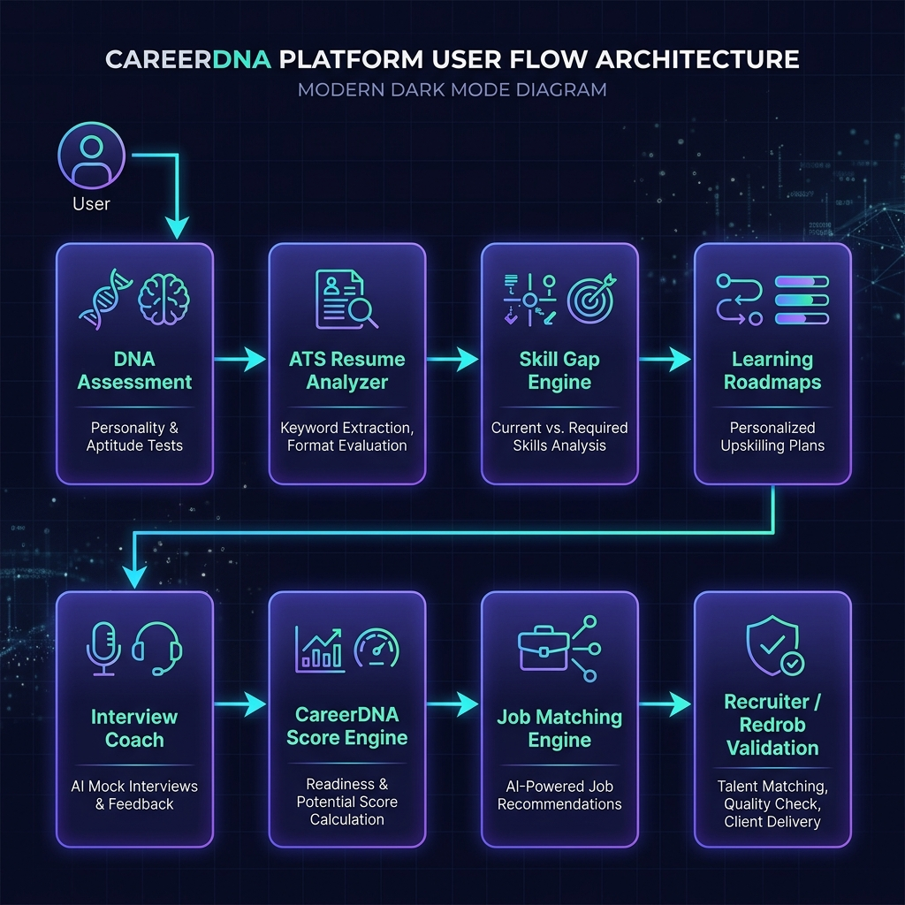
</div>

<br />

<div align="center">
  <h3><b>AI-Powered Employability Operating System</b></h3>
  <p>Empowering candidates with career diagnostics, ATS audits, audio simulator trials, and learning roadmaps, while validating talent verification pipelines for recruiter discovery.</p>
</div>

<div align="center">
  <a href="https://career-dna-woad.vercel.app">
    
  </a>
  <a href="https://github.com/niharikanarla879-beep/CareerDNA">
    
  </a>
</div>

---

## 📌 Submission Overview
* **Hackathon Evaluation:** Hack2Skill Track 3 & Redrob Evaluation
* **Developer Name:** Niharika Narla
* **Institute:** Sree Chaitanya Institute of Technological Sciences
* **Department:** Computer Science and Engineering (CSM)
* **Status:** Build Stable, fully-ready for evaluation.

---

## 📖 Overview
**CareerDNA** is an end-to-end, AI-powered employability diagnostics and career readiness platform. It bridges the gap between candidate qualifications and technical target benchmarks. Designed specifically for students, graduates, and switchers, CareerDNA maps behavioral profiles, audits resume ATS compliance client-side, runs speech-synthesis mock interviews, and dynamically details learning pathways to eliminate career preparation confusion.

---

## ⚠️ Problem Statement
* **Career Direction Confusion**: Candidates struggle to determine suitable vocational paths, resulting in misaligned resumes and high employee churn rates.
* **Skill Mismatch & Gaps**: There is a large gap between academic coursework and modern tech stack benchmarks required by companies.
* **ATS Rejections**: Over 75% of candidate resumes are filtered out by Automated Tracking Systems (ATS) due to missing keywords, non-standard formatting, and bad section hierarchies.
* **Lack of Scalable Practice**: Practicing mock interviews is either expensive or lacks actionable grading metrics on speech clarity and problem-solving.

---

## 💡 The Solution
CareerDNA addresses these challenges through a unified Candidate Sourcing & Readiness Loop:

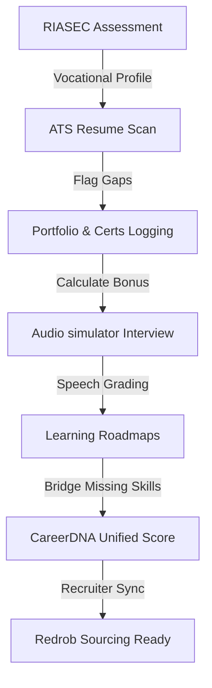
```mermaid
graph TD
    A[RIASEC Assessment] -->|Vocational Profile| B[ATS Resume Scan]
    B -->|Flag Gaps| C[Portfolio & Certs Logging]
    C -->|Calculate Bonus| D[Audio simulator Interview]
    D -->|Speech Grading| E[Learning Roadmaps]
    E -->|Bridge Missing Skills| F[CareerDNA Unified Score]
    F -->|Recruiter Sync| G[Redrob Sourcing Ready]
```

1. **DNA Decoder**: A 15-question psychometric questionnaire that maps Realistic, Investigative, Artistic, Social, Enterprising, and Conventional (RIASEC) traits to define target roles.
2. **ATS Resume Analyzer**: Parses PDF and Word documents client-side, analyzing keyword match rates, formatting structures, and section consistency.
3. **Resume Builder & Tailor**: Provides customizable layout templates (Classic, Minimal, Glass) and compares resume text directly against job descriptions to highlight missing keywords.
4. **Skill Gap Analyzer & Roadmaps**: Compiles missing competencies, linking them to Coursera, Udemy, and YouTube study playlists, with completion checklists to resolve gaps.
5. **AI Interview Coach**: Simulates technical panel interviews using browser-native Speech Synthesis (TTS) and Speech Recognition (STT) models to grade answers on concepts, clarity, and confidence.
6. **Career Explorer**: Side-by-side comparative grids detailing salaries, outlooks, and skills across 10 target careers.

---

## 🎥 Demo Video
### Hackathon Demo Walkthrough
[](https://www.youtube.com/watch?v=dQw4w9WgXcQ) *(Link Placeholder - 2-3 Minutes Walkthrough)*

#### Key Walkthrough Modules:
* **Psychometric Assessment**: DNA Decoder RIASEC interest mapping.
* **ATS Resume Analysis**: Client-side document parser scoring and tailing.
* **Skill Gap Detection**: Identifying competency gaps and linking interactive study plans.
* **Learning Roadmaps**: Node-based learning tracks with checkpoints.
* **AI Speech Interview Coach**: In-browser speech simulator testing confidence and grading answers.
* **DNA Score Engine**: Live overall metric weighting scoring candidate employability.
* **Job Sourcing Engine**: Client API pulling matching job opportunities.

---

## 🏆 Key Achievements

✅ **Client-side PDF & DOCX Parsing**: Fast local parsing via Web Workers (`pdfjs-dist` & `mammoth`).  
✅ **ATS Resume Analyzer**: Complete scoring matrices and keyword compliance analysis.  
✅ **AI Resume Builder**: Modular fields generating custom resumes dynamically.  
✅ **Resume Tailoring Engine**: Instant comparison against target job descriptions.  
✅ **RIASEC Career Assessment**: Interactive psychometric scoring mapping interest profiles.  
✅ **Skill Gap Analysis**: Flags technical holes and bridges them with study roadmaps.  
✅ **Learning Roadmaps**: Milestone checklists matching target careers.  
✅ **AI Interview Coach**: Dynamic voice speech-synthesis simulator practice trials.  
✅ **Projects & Certifications Tracker**: Strength auditor scoring GitHub commits and cloud certifications.  
✅ **DNA Score Engine**: Multi-metric unified scoring engine with gap penalties.  
✅ **Job Matching Engine**: Sourced from public endpoints filtered by skill matrices.  
✅ **Career Explorer**: Side-by-side career analytics comparing salaries, requirements, and growth.  
✅ **Recruiter & Judge Presentation Mode**: Guided floating walkthrough launcher.  
✅ **Career Report PDF Export**: High-fidelity candidate transcript print engine.  

---

## 🎯 Why CareerDNA Matters

### Problem Being Solved
Bridging the disconnect between candidate academic credentials and employer standards. Many students have high academic marks but lack the exact stack match or interview speech habits required in modern tech positions.

### Innovation
By executing heavy document parsing and Speech-to-Text evaluations directly inside the **browser sandbox**, CareerDNA eliminates server-side processing overhead. It provides instant, free diagnostics to candidates, keeping data strictly local and secure.

### Impact on Students
Empowers candidates with self-guided, automated career diagnostics. Students instantly discover where their resumes lack strength, which online courses to take, and can practice technical interviews in private before official recruiting.

### Impact on Recruiters
Accelerates sourcing loops by providing recruiter-ready, pre-vetted candidate records. Instead of screening hundreds of resumes, recruiters look at verified DNA profiles containing verified scores, certified credentials, and recorded presentation evaluations.

### Integration Value for Redrob
CareerDNA fits perfectly into the **Redrob Ecosystem** as an **Employability Validator**. Candidates sign up on CareerDNA to assess their skills, build resumes, track roadmaps, and practice interviews. This generates a secure CareerDNA score that Redrob recruiters use to filter high-readiness candidates instantly.

### AI-First Approach
Utilizes client-side audio recognition to calculate clarity metrics, paired with Gemini API models to parse, review, and suggest resume tailoring bullets, creating a personalized copilot for candidates.

### Employability Improvement
Candidates go from general confusion to a print-ready, verified transcript and optimized resume, prepared for immediate hiring.

---

## 🖼️ Screenshots

Below are actual user interface screens of the key modules in the CareerDNA ecosystem:

### 1. Landing Page
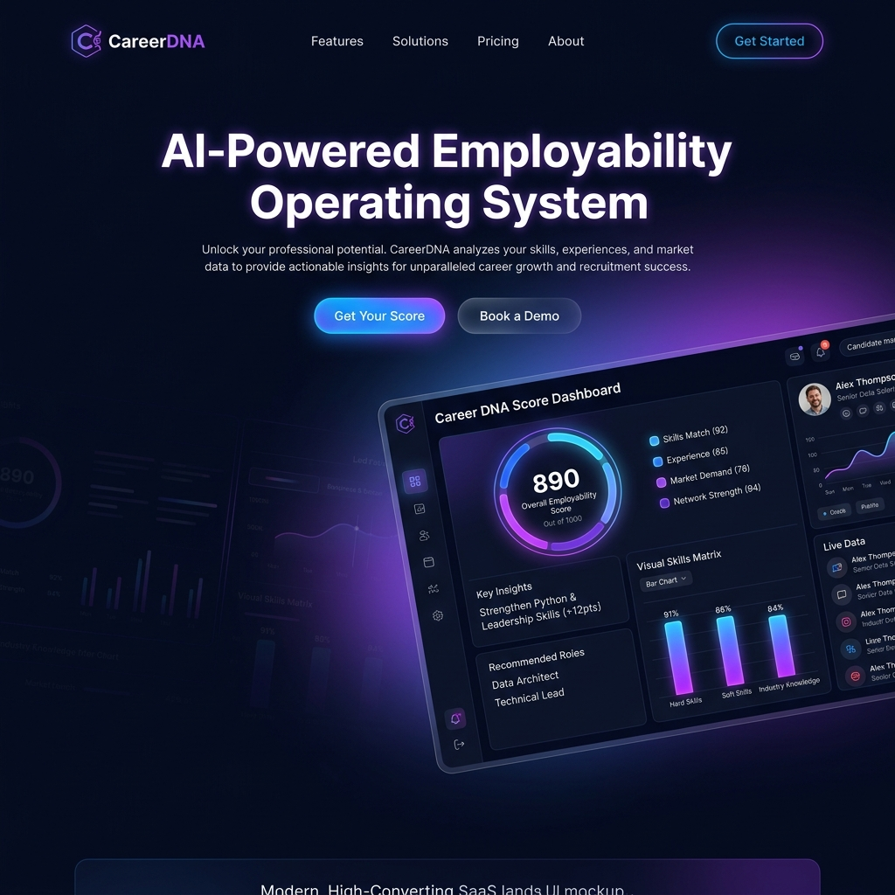
*A sleek, modern glassmorphic landing page introducing the CareerDNA value loop.*

### 2. Dashboard Overview
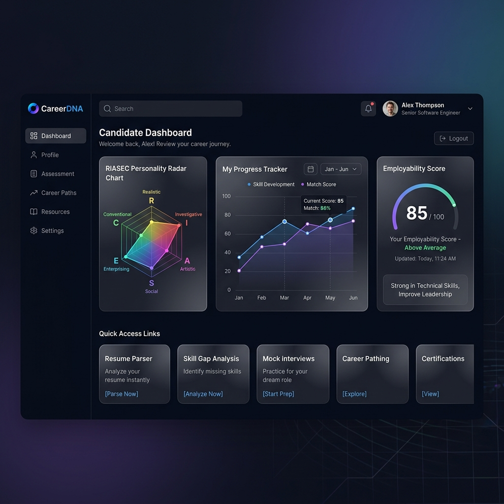
*Candidate panel showing CareerDNA overall rating, RIASEC radar, and stepper progress.*

### 3. ATS Resume Analyzer
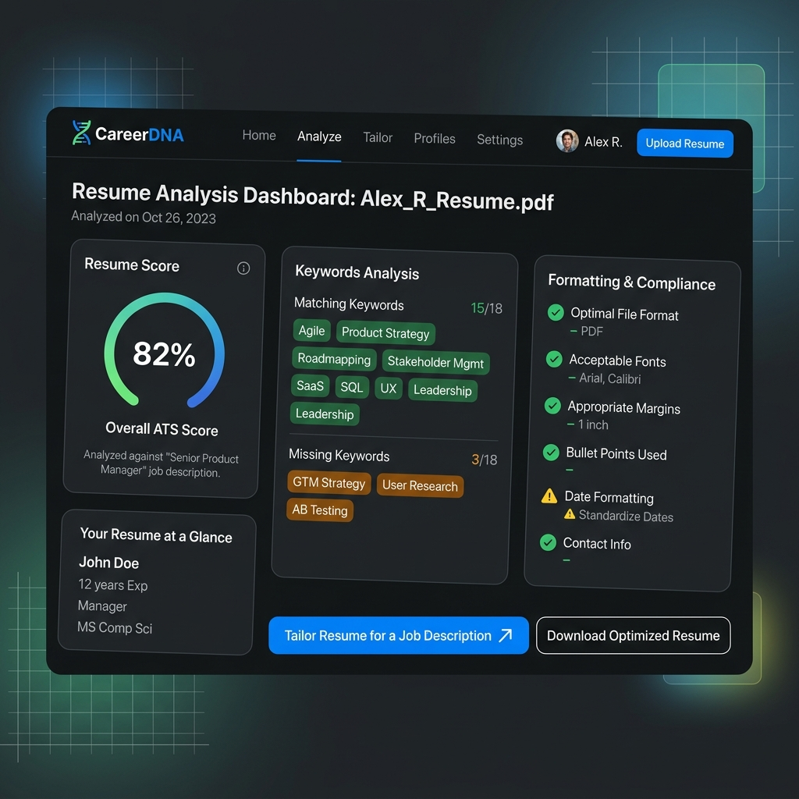
*Detailed upload dashboard showing ATS rating, parsed keywords, and strengths/weaknesses suggestions.*

### 4. AI Resume Builder
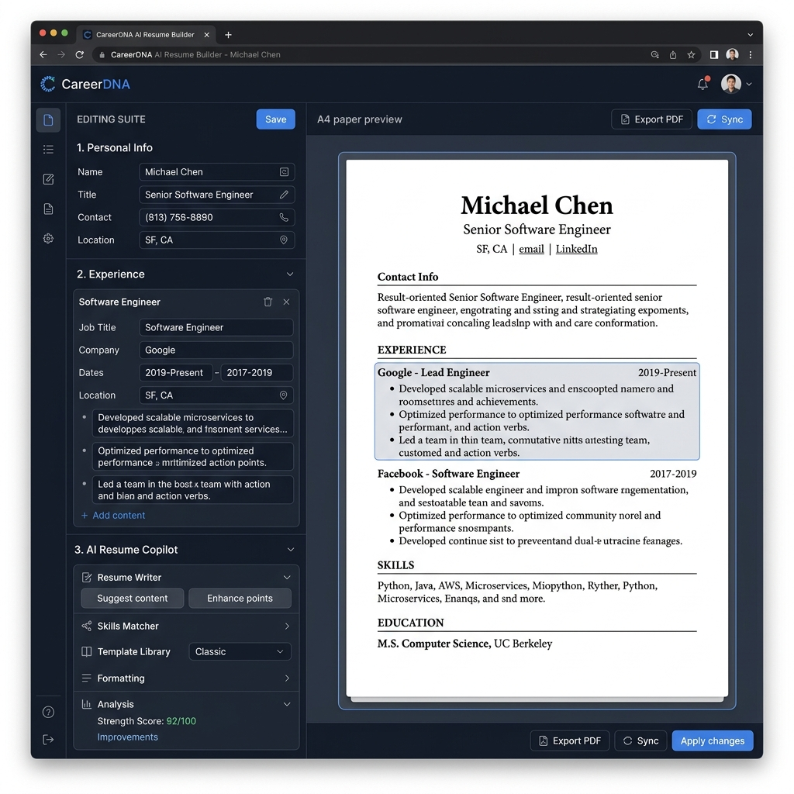
*A split-screen layout with an editing suite panel on the left (personal info, experience forms, AI resume copilot options) and a live interactive A4 resume preview sheet.*

### 5. Projects & Certifications Tracker
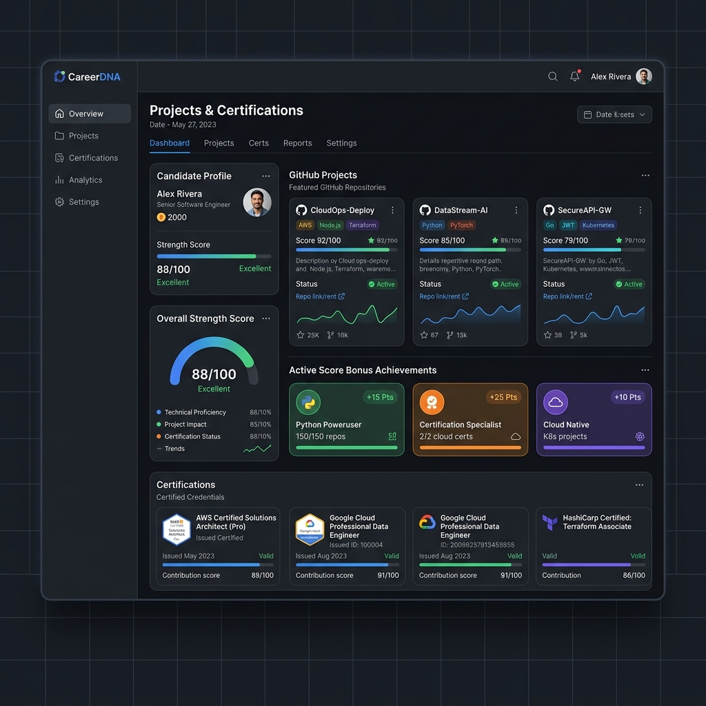
*Modern dark mode dashboard displaying cards of candidate GitHub repositories, calculated strength scores, certified credentials, and active score bonus achievements.*

### 6. Skill Gap Analyzer
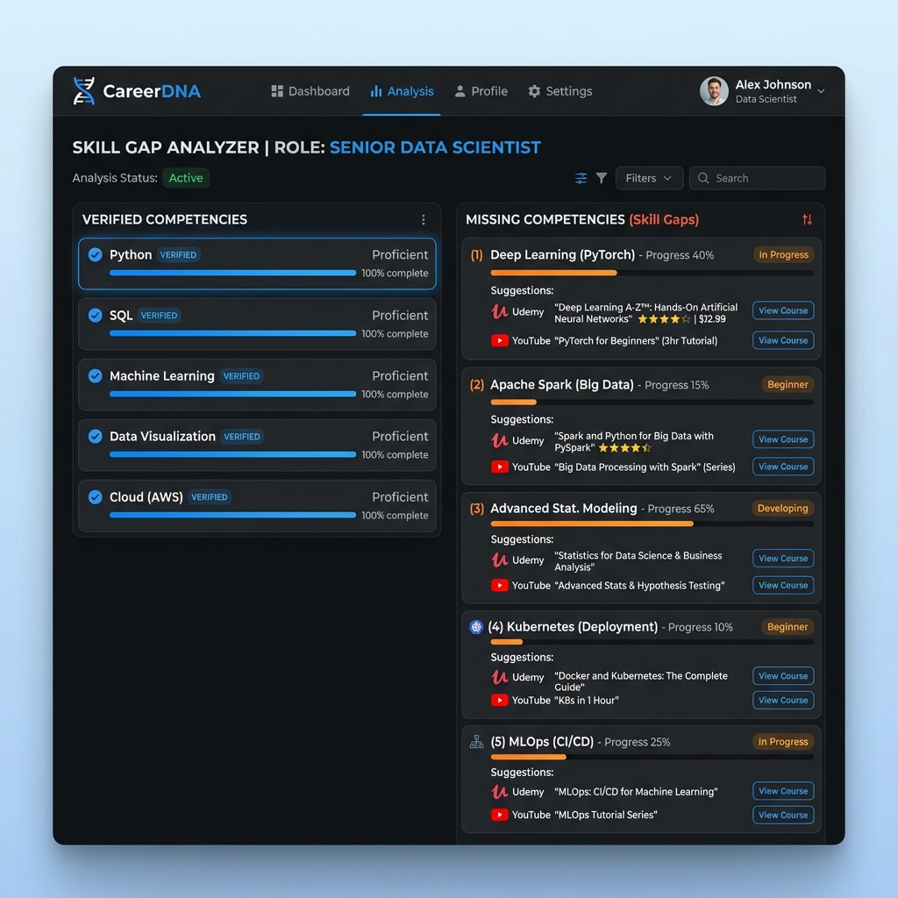
*A visual dark mode panel listing verified vs missing technical competencies side by side.*

### 7. Learning Roadmaps
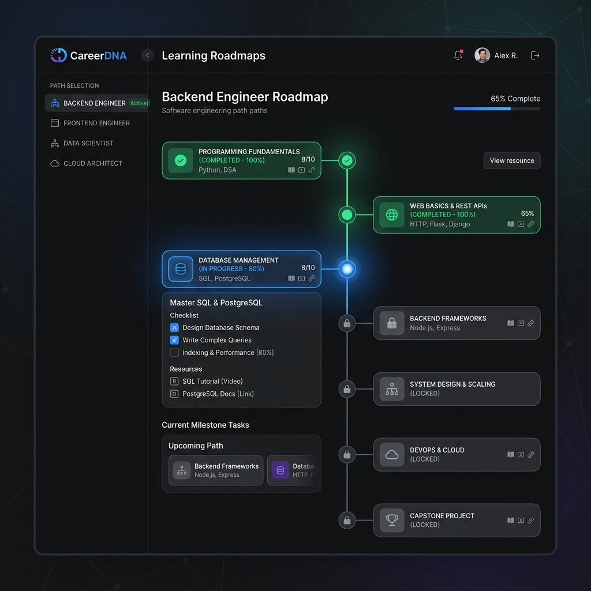
*Displays a beautiful vertical timeline node-based layout (roadmaps) in dark mode, showcasing structured learning milestones.*

### 8. Job Matcher
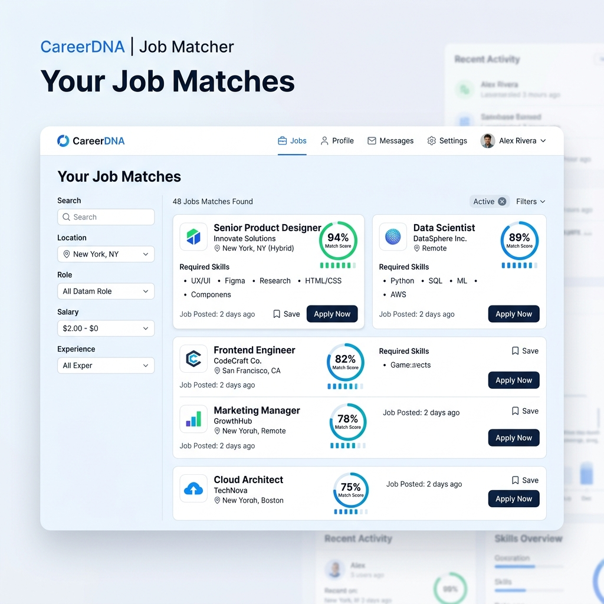
*A modern card list of job postings, showing job title, company, compatibility percentage matching scores.*

### 9. AI Interview Coach
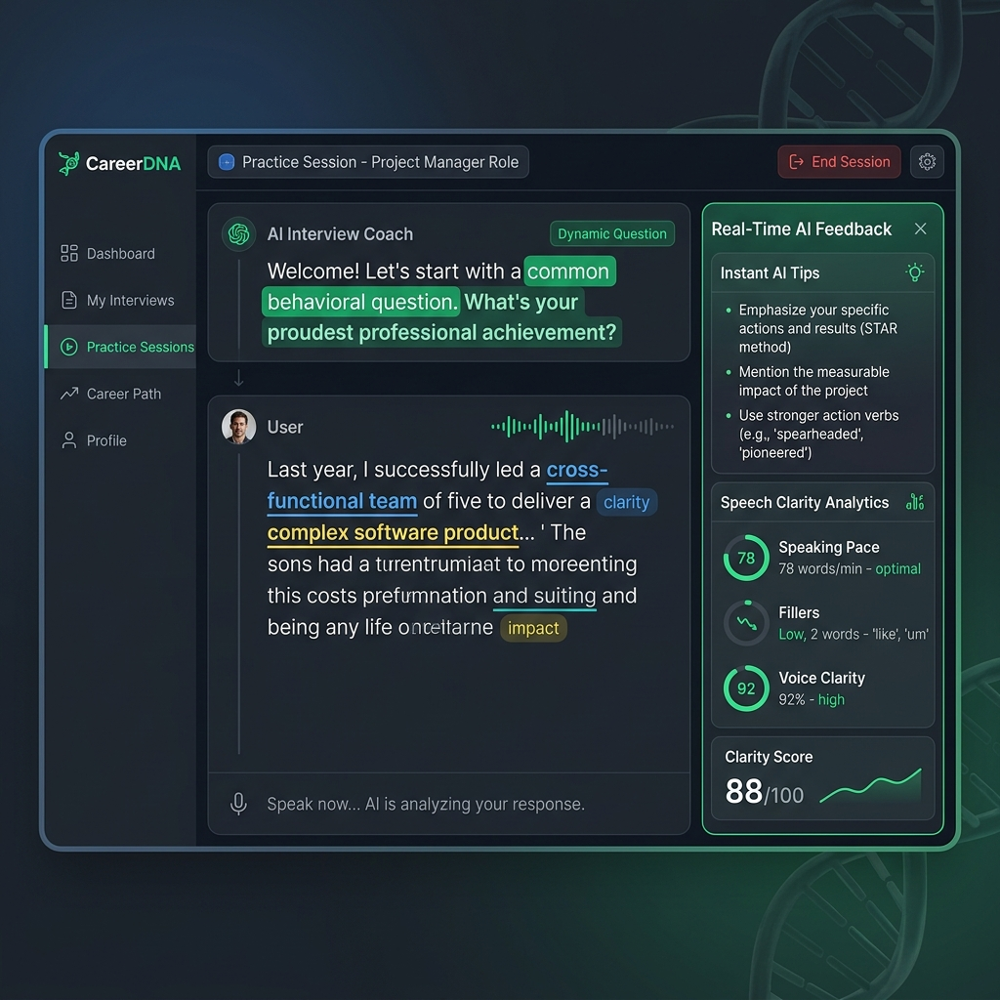
*Speech-synthesis simulator practice screen with technical grading cards.*

### 10. DNA Score Engine
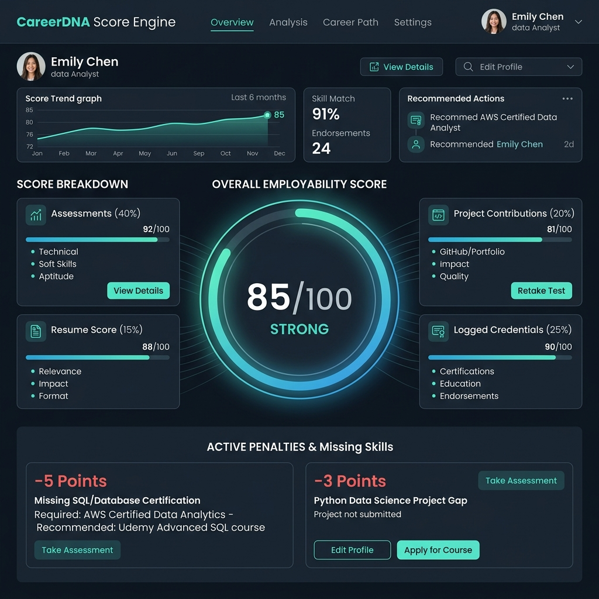
*Circular progress gauge indicating unified score and active penalties/bonuses.*

---

## 🛠️ Technology Stack
* **Frontend**: Next.js 16.2.9 (App Router, Turbopack), React 19.2.4, TypeScript 5.x, Tailwind CSS 4.x
* **Data Visualization**: Recharts 3.8.1 (Polar Grid angle layout, Custom Tooltips)
* **File Extractors**: `pdfjs-dist` (PDF extraction worker) and `mammoth` (Word docx XML extraction)
* **Speech Integration**: HTML5 SpeechSynthesis and Web Speech API WebkitSpeechRecognition
* **Deployment**: Deployed on Vercel Edge Server Infrastructure
* **State Persistence**: Sandboxed `LocalStorage` client-side sync across browser tabs via storage listeners

---

## 🏗️ System Architecture & Data Flow
CareerDNA is designed around a secure, local-first sandbox model to ensure privacy, performance, and offline compatibility:

```
[Candidate Documents] ──> [Client Workers (PDFJS/Mammoth)] ──> [ATS Parser Engine]
                                                                      │
[Vocational Decoder] ──> [RIASEC Metric Calculators] ──────────────────┼──> [Unified Scores Engine] ──> [LocalStorage Cache]
                                                                      │
[Web Speech API STT] ──> [Audio Speech Simulators] ───────────────────┘
```

* **Document Sandbox**: Uploaded resumes never leave the candidate's browser. Parsing workers process files inside a client-side thread pool, generating local variables for keyword checks.
* **Synchronized State**: Any score adjustments (e.g. logging projects, completing course roadmaps, or uploading new resumes) are stored in `localStorage` under keys matching the user ID. Event listeners immediately propagate updates to all active dashboard tabs.

---

## ⚙️ Installation & Setup

1. **Clone the Repository**:
   ```bash
   git clone https://github.com/niharikanarla879-beep/CareerDNA.git
   cd CareerDNA
   ```

2. **Install Dependencies**:
   ```bash
   npm install
   ```

3. **Verify Environment Configuration**:
   Create a `.env.local` file in the root folder (values default to mock fallback sandbox mode if omitted):
   ```env
   NEXT_PUBLIC_SUPABASE_URL=placeholder
   NEXT_PUBLIC_SUPABASE_ANON_KEY=placeholder
   GEMINI_API_KEY=placeholder
   ```

4. **Launch Local Server**:
   ```bash
   npm run dev
   ```
   Open [http://localhost:3000](http://localhost:3000) inside your web browser.

---

## 👤 Demo Credentials
Click the golden **"Launch Demo Candidate Mode"** button on the landing or login screen to bypass registration. This instantly populates:
* **Account Info**: Demo Candidate (Associate Developer, 2 Years Experience)
* **RIASEC Scores**: Complete Interest profile (Realistic: 70, Investigative: 90...)
* **Portfolio**: 3 logged repositories (InsightX Search, Agri Marketplace...)
* **Resume Scan**: Pre-loaded 84% ATS resume audit.
* **Interviews**: 2 technical speech sims grading React state and SQL indexing.

---

## 📂 Project Structure
```
CareerDNA/
├── src/
│   ├── app/                    # Next.js App Router folders
│   │   ├── dashboard/          # Candidate strategist sub-modules
│   │   │   ├── assessment/     # RIASEC questionnaire
│   │   │   ├── career-explorer/# Side-by-side compare
│   │   │   ├── interview-coach/# STT/TTS interview simulation
│   │   │   ├── report/         # Print-media transcript
│   │   │   └── skill-gap/      # Competency roadmaps
│   │   ├── login/              # Sandbox warning page
│   │   └── page.tsx            # Premium landing layout
│   ├── components/             # Reusable UI controls (Toast, presentation, etc.)
│   └── lib/                    # Scoring contexts, custom hooks, and databases
├── public/                     # Static svgs & worker files
└── FINAL_READINESS_REPORT.md   # Launch quality deliverables report
```

---

## 📄 License
This project is licensed under the MIT License - see the [LICENSE](LICENSE) file for details.
