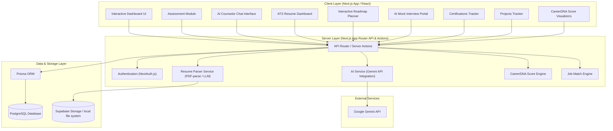

# System Architecture - CareerDNA

This document details the software architecture, technical choices, data flow, and components of the CareerDNA platform.

---

## 1. High-Level Architecture Diagram

---

## 2. Technology Stack & Rationale

| Layer | Technology | Selection Rationale |
| :--- | :--- | :--- |
| **Framework** | **Next.js 14+ (App Router)** | Provides Server-Side Rendering (SSR) for fast loading times, built-in API routing, React Server Components (RSC) for optimization, and simplified file-based routing. |
| **Language** | **TypeScript** | Ensures type safety across the application, reducing run-time bugs and facilitating cleaner data model representations. |
| **Styling** | **Vanilla CSS & CSS Modules** | Ensures maximum customization, absolute control over animations, zero configuration dependency issues, and lightweight page loads without massive utility frameworks. |
| **Authentication** | **NextAuth.js (Auth.js)** | Seamless integration with Next.js, supporting Credentials (email/password) and third-party logins (GitHub, Google) with session cookies. |
| **Database** | **PostgreSQL** | Relational capabilities to support structured matching algorithms, nested career roadmaps, and profile hierarchies. |
| **ORM** | **Prisma** | Offers auto-generated migrations, type-safe queries out of the box, and easy relationships definitions. |
| **AI Processing** | **Google Gemini SDK** | Highly efficient, high-context window model ideal for detailed resume analysis, parsing unstructured text, and hosting long-context conversational mentoring sessions. |
| **File Parser** | **PDF-parse / mammoth** | Simple Node-based utilities to extract raw text content from PDF and DOCX uploads for direct processing by the LLM. |

---

## 3. Core Component Design

### 3.1. Authentication & Session Manager
- Handles session lifecycle using stateless JSON Web Tokens (JWT) or secure database session cookies.
- Protects endpoints and pages via middleware routing (`src/middleware.ts`).

### 3.2. Assessment Coordinator
- A state-machine client side that manages the onboarding questionnaire stages:
  1. RIASEC Questionnaire (Interactive Slider / Scale cards).
  2. Values Priority Selection (Drag-and-drop hierarchy list).
  3. Skill Selector (Tag-based matching).
- Sends final results payloads to `/api/assessments/submit` to run career matches.

### 3.3. ATS Resume Analyzer
- Orchestrates file uploads, extracts raw text content, and calls the AI Parser Service.
- Evaluates keywords, format structure, and missing skills.
- Returns an ATS Score (0-100) along with detailed JSON feedback.

### 3.4. AI Interview Coach
- Fetches custom questions (HR, Technical, Behavioral) from the Gemini AI Service based on the target career role.
- Mock Interview Mode records/receives answers (via text input or speech-to-text API).
- Evaluates inputs using the AI engine to generate an Interview Score (0-100) and actionable constructive feedback.

### 3.5. Projects & Certifications Trackers
- Captures metadata of certifications (relevance, completion states) and portfolio projects (GitHub repositories, live demonstration URLs).
- Evaluates strengths:
  - **Certificate Score**: Maps certificates against target career relevance.
  - **Project Strength Score**: Computes project quality based on description completeness, GitHub link validity, and tech stack alignment.

### 3.6. CareerDNA Score Engine
- A service that dynamically synthesizes a user's scores into a single composite **CareerDNA Score (0-100)**:
  - Formula: `CareerDNA Score = (w1 * ResumeScore) + (w2 * SkillsScore) + (w3 * ProjectsScore) + (w4 * CertificationsScore) + (w5 * InterviewScore)`
  - Weights (`w1` through `w5`) are normalized based on target career profile importance (e.g., software roles weigh projects higher, project management roles weigh certifications higher).

### 3.7. Job Match Engine
- Takes the user profile, CareerDNA metrics, and specific job listings (or standard profiles).
- Computes compatibility score (percentage match) and generates strengths/weaknesses and career path recommendations.

### 3.8. AI Counselor Chat Service
- Maintains chat history.
- API route streaming answers back to the UI in real-time.
- Feeds system prompts containing user metadata (skills, target career, assessment scores, CareerDNA Scorecard) to keep context highly personalized.

---

## 4. Key Data Flows

### 4.1. The User Assessment & Match Flow
1. User completes RIASEC and Values questions.
2. Client submits responses to Next.js server actions.
3. Server saves raw scores to `AssessmentResult`.
4. Matching engine runs matching analysis against predefined career profiles.
5. Server saves generated career matches and gaps inside `CareerMatch` tables.
6. Client fetches and displays the dashboard with interactive visualizations.

### 4.2. ATS Resume Parsing & Feedback Flow
1. User uploads a PDF/DOCX resume file.
2. Next.js API route parses file buffer into plain text.
3. Plain text is cross-referenced with target career metadata.
4. Gemini API parses text, scans formatting flags, matches keywords, detects missing skills, and calculates the ATS Score.
5. Structured JSON is returned, saved in `Resume` table, and triggers a recalculation of the composite CareerDNA Score.

### 4.3. Mock Interview Session & Evaluation
1. Client requests questions for a specific career path.
2. Server API fetches a customized set of HR, Technical, and Behavioral questions.
3. User goes through Mock Interview Mode and submits answers.
4. Gemini API evaluates each answer against model expectations.
5. Server saves the results, computes the final interview score, and updates the database, prompting a refresh of the CareerDNA Score.

### 4.4. CareerDNA Score Synthesis
1. When any metric changes (new resume uploaded, project added, mock interview completed, certificate registered):
2. Server calls `ScoreEngine` to retrieve all scores (Resume, Skills, Projects, Certs, Interviews).
3. The engine computes the weighted composite CareerDNA Score.
4. The user's profile is updated, and the live dashboard widgets are re-rendered.
