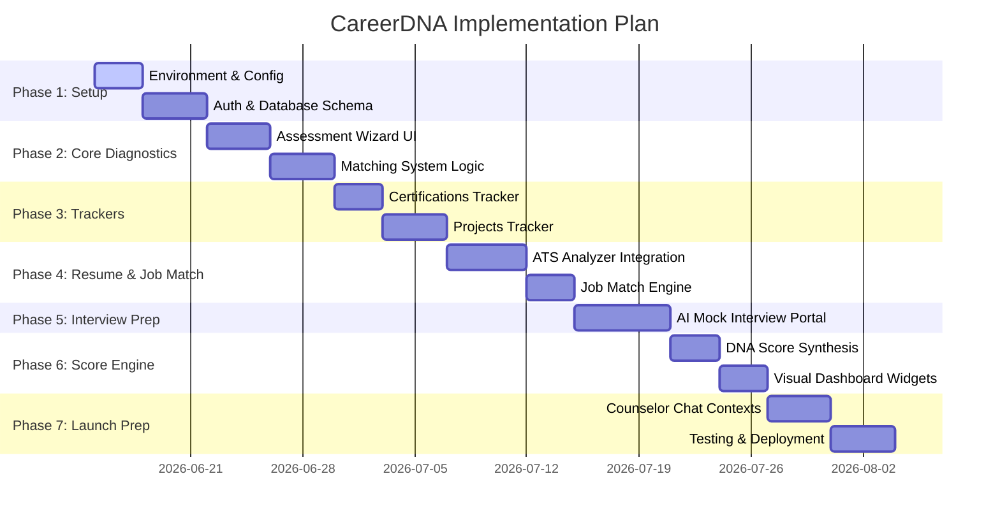

# Development Plan - CareerDNA

This document defines the roadmap and sequential tasks for building, testing, and launching the CareerDNA platform with all added core modules.

---

## 1. Roadmap Phases

---

## 2. Phase Breakdown

### Phase 1: Foundation & Database Setup (Duration: 7 Days)
- **Task 1.1: Project Initialization**
  - Run Next.js structure boilerplate configuration.
  - Setup TypeScript configuration (`tsconfig.json`).
  - Configure ESLint, Prettier, and core workspace layouts.
- **Task 1.2: Database & Prisma Setup**
  - Connect Prisma to PostgreSQL.
  - Apply the schema (including user profiles, skills, projects, certifications, assessments, matches, resumes, interview sessions, and score models).
  - Write database client singleton (`src/lib/db.ts`).
- **Task 1.3: User Authentication**
  - Setup NextAuth.js.
  - Build responsive login and registration interfaces.
  - Implement middleware rules (`src/middleware.ts`) protecting private routes.

### Phase 2: Onboarding & Diagnostic Core (Duration: 8 Days)
- **Task 2.1: Onboarding Assessment UI**
  - Build step-by-step diagnostic questionnaire UI (RIASEC interest sliders, priority ranking cards for work values).
- **Task 2.2: Career Seed Data Registry**
  - Create standard reference catalog of 100+ occupations with their RIASEC scores, entry requirements, salary profiles.
- **Task 2.3: Algorithmic Scoring Engine**
  - Implement vector matching between user's RIASEC scores + values, and the seed data registry.
  - Save matched entries into the `CareerMatch` model.

### Phase 3: Project & Certification Tracking (Duration: 7 Days)
- **Task 3.1: Certifications Tracker Component**
  - Build UI portal to log certifications (issuer, credentials, status).
  - Implement background scoring function allocating certificate strength relevance based on matching target careers.
- **Task 3.2: Projects Tracker Component**
  - Design portal for logging user portfolio projects (description, GitHub URLs, and hosted demo URLs).
  - Write `strengthScore` calculator verifying GitHub links and description density.

### Phase 4: ATS Resume Analyzer & Job Match Engine (Duration: 8 Days)
- **Task 4.1: ATS File Parser Service**
  - Build file upload route for PDF/DOCX resumes.
  - Implement plain text parsing on the server.
- **Task 4.2: AI ATS Analyzer & Formatting Auditor**
  - Feed resume text to Gemini API to compute the ATS Score, parse keyword distributions, detect formatting blocks (multi-columns, tables), and list missing skills.
- **Task 4.3: Job Match Engine**
  - Create service mapping the user's parsed profile against specific target job listings to calculate compatibility percentage, strengths, and weaknesses.

### Phase 5: AI Interview Preparation & Coaching (Duration: 6 Days)
- **Task 5.1: Interview Question Generator API**
  - Create route generating relevant HR, Technical, and Behavioral questions based on target roles.
- **Task 5.2: Mock Interview Mode UI**
  - Design interactive wizard walking user through questions, accepting written responses, and showcasing a timer.
- **Task 5.3: Question Scorer & Feedback Generator**
  - Leverage Gemini API to review answers, output score out of 100 per question, outline strengths, grammatical errors, and compile feedback.

### Phase 6: CareerDNA Score Engine & Dashboard (Duration: 6 Days)
- **Task 6.1: Composite Score Calculation Service**
  - Create scoring module aggregating resume score, skills match, projects score, certifications progress, and mock interview score.
  - Save final value into `CareerDnaScore` model.
- **Task 6.2: Interactive Score Visualizers**
  - Create premium dashboard visual cards, radial progress indicators, and radar chart showcasing score breakdown.

### Phase 7: Advisor Chat & Release Prep (Duration: 8 Days)
- **Task 7.1: Context-Aware AI Counselor Chat**
  - Setup Gemini chat API streaming responses using Vercel AI SDK or direct streaming.
  - Provide system prompts passing active user profile data, CareerDNA scores, gaps, and roadmap stats.
- **Task 7.2: Integration Testing & Verification**
  - Run Jest/Vitest unit tests for scoring engine logic.
  - Verify auth gates, session states, and database cascading.
- **Task 7.3: Deploy**
  - Push codebase to Vercel/Supabase and perform live production checks.

---

## 3. Verification & Validation Plan

### Automated Verification
- **Unit Tests**:
  - Run `npm run test` validating the composite scoring weights, RIASEC matching vector formulas, and parser text-extraction handlers.
- **Production Compile**:
  - Run `npm run build` validating absolute type safety and routing parameters.

### Manual Verification Checklist
- **ATS Upload Audits**: Validate that complex resumes are parsed cleanly, scoring is reliable, and formatting triggers alert flags.
- **Interview Flow Resiliency**: Simulate dropping connection mid-interview and check if session answers are preserved.
- **Responsive Dashboard Elements**: Verify canvas/SVG charts scale properly across standard viewport sizes.
